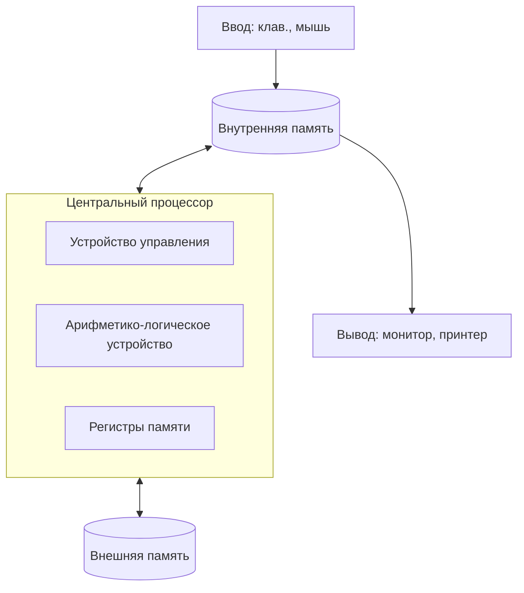

# 🖥️ Тема: Устройства компьютера (Hardware)

Конспект подготовлен для подготовки к ЕНТ.  
Компьютер — это электронная вычислительная машина для приема, обработки, хранения и передачи информации.

Разработка ведётся по двум направлениям:
- Аппаратное обеспечение (**Hardware**)
- Программное обеспечение (**Software**)

---

## 🏗️ 1. Архитектура Джона фон Неймана

В 1945 году принципы современной архитектуры компьютера предложил Джон фон Нейман.  
Эти принципы актуальны до сих пор.

### Основные компоненты архитектуры:

1. **Арифметико-логическое устройство (АЛУ)** — выполняет вычисления.
2. **Устройство управления (УУ)** — руководит работой всех устройств.
3. **Память** — хранит программы и данные.
4. **Устройства ввода и вывода** — обеспечивают связь с внешним миром.

### Принципы работы:

- **Двоичное кодирование** — вся информация хранится в виде 0 и 1.
- **Однородность памяти** — команды и данные хранятся вместе.
- **Адресность** — память состоит из пронумерованных ячеек.

---

## 🧠 2. Центральный процессор (CPU) — «Мозг» компьютера

Процессор обрабатывает данные и управляет работой всех компонентов системы.

### Состав процессора:

- **Устройство управления (УУ)** — берет команду из памяти и определяет порядок её выполнения.
- **АЛУ** — выполняет математические и логические операции.
- **Регистры** — сверхбыстрая внутренняя память процессора.
- **Сумматор** — участвует в арифметических операциях.
- **Счётчик команд** — указывает адрес следующей команды.
- **Регистр команд** — хранит код текущей команды.

### Характеристики процессора (для ЕНТ):

- **Тактовая частота** — количество операций в секунду (Гц, МГц, ГГц).
- **Разрядность** — количество бит, обрабатываемых за один такт.
- **Количество ядер** — влияет на многозадачность.
- **Объем кэш-памяти** — буферная память для ускорения доступа.
- **Техпроцесс** — размер транзисторов в нанометрах (нм). Чем меньше техпроцесс, тем выше производительность.

---

## 💾 3. Память компьютера

Память делится на внутреннюю (электронную) и внешнюю (на носителях).

### Внутренняя память:

| Тип | Описание | Энергозависимость |
|------|------------|------------------|
| **ОЗУ (RAM)** | Временное хранение данных в процессе работы | Да (стирается) |
| **ПЗУ (ROM)** | Хранит BIOS и программы запуска | Нет (сохраняется) |
| **Кэш-память** | Сверхбыстрый буфер между CPU и ОЗУ | Да |
| **CMOS** | Хранит настройки BIOS, дату и пароли (от батарейки) | Нет |
| **Видеопамять (VRAM)** | Хранит данные для вывода изображения на экран | Да |

### Внешняя память (для длительного хранения):

- **Жесткий диск (HDD, винчестер)** — основной накопитель большой емкости.
- **Твердотельный накопитель (SSD)** — более быстрый тип накопителя.
- **Оптические диски**:
  - CD-R/RW — до 700 МБ
  - DVD-R/RW — 4.7–17 ГБ
- **Флеш-память** — компактный съемный носитель.

---

## 📟 4. Системный блок и периферия

**Конфигурация** — набор комплектующих и их характеристик.

### В системный блок входят:

- **Материнская плата** — соединяет все устройства.
- **Процессор (CPU)** — обработка данных.
- **Оперативная память (RAM)** — быстрая рабочая память.
- **Видеокарта** — обработка и передача графики.
- **Жесткий диск / SSD** — хранение данных.
- **Блок питания** — преобразует ток в 5В или 12В.
- **Сетевой адаптер** — подключение к сети.

### Периферийные устройства

**Устройства ввода:**
- клавиатура  
- мышь  
- сканер  
- веб-камера  
- микрофон  

**Устройства вывода:**
- монитор  
- принтер  
- проектор  
- колонки  
- наушники  
