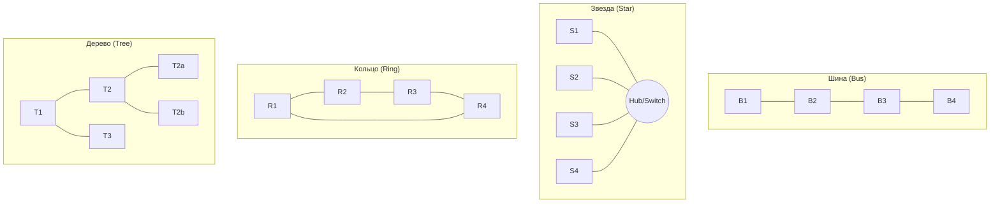
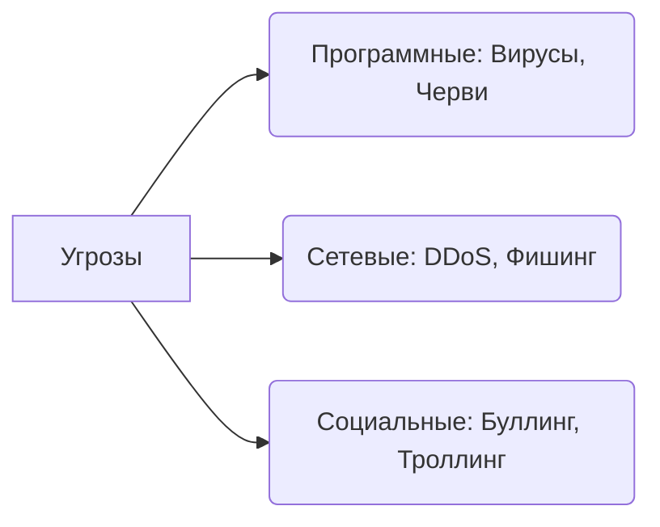

# 🌐 Полный конспект: Компьютерные сети и информационная безопасность

## 1. Организация компьютерных сетей

**Компьютерная сеть** — это система обработки информации, предназначенная для объединения двух или более устройств (узлов) с целью обмена данными и совместного использования ресурсов.

---

## 🏗️ Классификация сетей

### А. По масштабу (территориальный охват):

- **PAN (Personal Area Network)** — персональная сеть вокруг одного человека (телефон, планшет, наушники).
- **LAN (Local Area Network)** — локальная сеть в пределах здания или предприятия (до 1–2 км).
- **WLAN (Wireless LAN)** — беспроводная локальная сеть (Wi‑Fi, Bluetooth).
- **MAN (Metropolitan Area Network)** — городская сеть.
- **WAN (Wide Area Network)** — глобальная сеть на больших расстояниях (например, Интернет).

---

### Б. По типу среды передачи

**Проводные:**
- Витая пара — до 1000 Мбит/с.
- Коаксиальный кабель — до 10 Мбит/с.
- Оптоволоконный кабель — более 10 Гбит/с.

**Беспроводные:**
- Радиосвязь
- Wi‑Fi
- WiMAX
- Bluetooth
- Инфракрасная связь
- Спутниковая связь

---

### В. По принадлежности

- Ведомственные
- Государственные

---

### Г. По скорости передачи

- Низкоскоростные — до 10 Мбит/с  
- Среднескоростные — до 100 Мбит/с  
- Высокоскоростные — свыше 100 Мбит/с  

---

## 📐 2. Сетевые топологии

**Топология сети** — физическое расположение компьютеров относительно друг друга.

| Тип топологии | Описание | Надежность |
|---------------|----------|------------|
| Шина | Все узлы подключены к одному каналу | Сбой одного ПК может прервать связь |
| Кольцо | Сигнал идет по замкнутому кругу | Выход одного устройства останавливает сеть |
| Звезда | Все ПК подключены к центральному узлу | Сбой одного ПК не влияет на остальных |
| Дерево | Иерархическая структура | Используется в организациях |
| Смешанная | Комбинация топологий | Гибкость и масштабируемость |

---

## ⚙️ 3. Сетевые компоненты

### Абонентские системы

- **Сервер** — мощный компьютер, предоставляющий ресурсы.
- **Клиент (рабочая станция)** — использует ресурсы сервера.

### Сетевое оборудование

- **Hub** — пересылает данные на все порты.
- **Switch** — передает данные конкретному устройству по MAC-адресу.
- **Router** — соединяет разные сети и выбирает путь передачи.
- **Модем** — обеспечивает связь через провайдера.

---

## 🌐 4. IP-адресация и доменные имена

### IP-адрес

Уникальный числовой идентификатор устройства.

- **IPv4** — 32 бита (например, 192.168.1.1).
- **IPv6** — 128 бит.

### Виды IP

- Внутренние (10.x.x.x, 172.16.x.x, 192.168.x.x)
- Внешние
- Статические
- Динамические

### Классы IP

| Класс | Первый бит(ы) | Назначение | Границы |
|-------|---------------|------------|------------|
| A | 0 | Крупные сети | 1 - 126 |
| B | 10 | Средние сети | 128 - 191 |
| C | 110 | Малые сети | 192 - 223 | 
| D | 1110 | Многоадресная рассылка | 224 - 239 | 
| E | 11110 | Экспериментальный | 240 - 255 |

**Маска подсети** — отделяет адрес сети от адреса узла.

### DNS

Система доменных имен связывает IP-адрес с понятным именем.

Уровни:
- Верхний (.kz, .ru, .com, .edu, .gov, .net, .org)
- Второй (example.kz)
- Третий (blog.site.kz)

---

## 🛡️ 5. Информационная безопасность

**ИБ** — защита информации от потери, искажения и несанкционированного доступа.

### Три аспекта ИБ

- **Доступность**
- **Целостность**
- **Конфиденциальность**

---

### ⚠️ Угрозы
| Термин | Описание (суть) |
|--------|------------------|
| Вирусы | Программы, внедряющиеся в файлы; требуют запуска пользователем для активации. |
| Трояны | Вредоносное ПО, маскирующееся под полезные программы для кражи данных. |
| Черви | Самораспространяющиеся программы; заражают сеть без участия пользователя. |
| Ботнеты | Сеть зараженных устройств («зомби»), управляемых хакером для массовых атак. |
| DoS/DDoS | Атака запросами для перегрузки и остановки работы сервера или сайта. |
| Фишинг | Создание фальшивых сайтов или писем для кражи логинов, паролей и данных карт. |
| Кибербуллинг | Намеренная травля, угрозы и унижение человека в цифровом пространстве. |
| Троллинг | Публикация провокационных сообщений для вызова конфликтов и гнева. |
| Хейт-спич | Агрессивные высказывания, разжигающие ненависть к группам людей. |

---

### 🛡️ Методы защиты

**Технические:** видеонаблюдение, сигнализация  
**Программные:** антивирусы, шифрование, firewall  
**Организационные:** резервное копирование  
**Правовые:** законы об ЭЦП  

---

### 👤 Идентификация и аутентификация

- Регистрация  
- Идентификация (логин)  
- Аутентификация (пароль, биометрия)  

**Методы:**  
- Пароль  
- ID-карта  
- Биометрия  

**ЭЦП** — подтверждение подлинности электронного документа.

